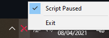

# How to use
Simply execute the .exe of the character you want.

If you click on the icon the script will pause and give you the option for unpause or exit.

Programed with AutoIt: https://www.autoitscript.com/site/
