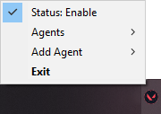
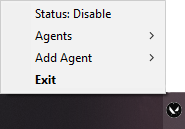
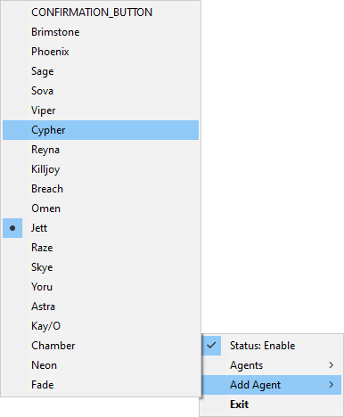
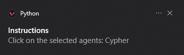
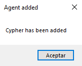
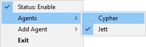

# Valorant Instalocker
Program to be the first to choose an agent in Valorant by manually and easily adding the position of the agents to obtain a simple and self-configuring program as a result.

  

 

# Configuration ⚙️
To configure there are 3 options:

**ENABLE/DISABLE**
- Select the agent from the list of `Add agent`. 
    
    

**ADD AGENT**
- Select the agent from the list of `Add agent`. 
    

- Click on the selected Agent in the game to save its coordinates and colors. 
     
    

**PICK AGENT**
- Select the agent from the list of `Agents`. 
    
  

# How to use 📝
You must configure the agent before you can use it, to do this follow the configuration section, after configuring it you must select it and the program will detect the agent selection screen to make the instalock.
  

# Supported languages 🌍
At the moment the supported languages are `'en'` and `'es'`. If you want to add a new language just copy the file inside `data` called `en.json` and modify the values to your language.